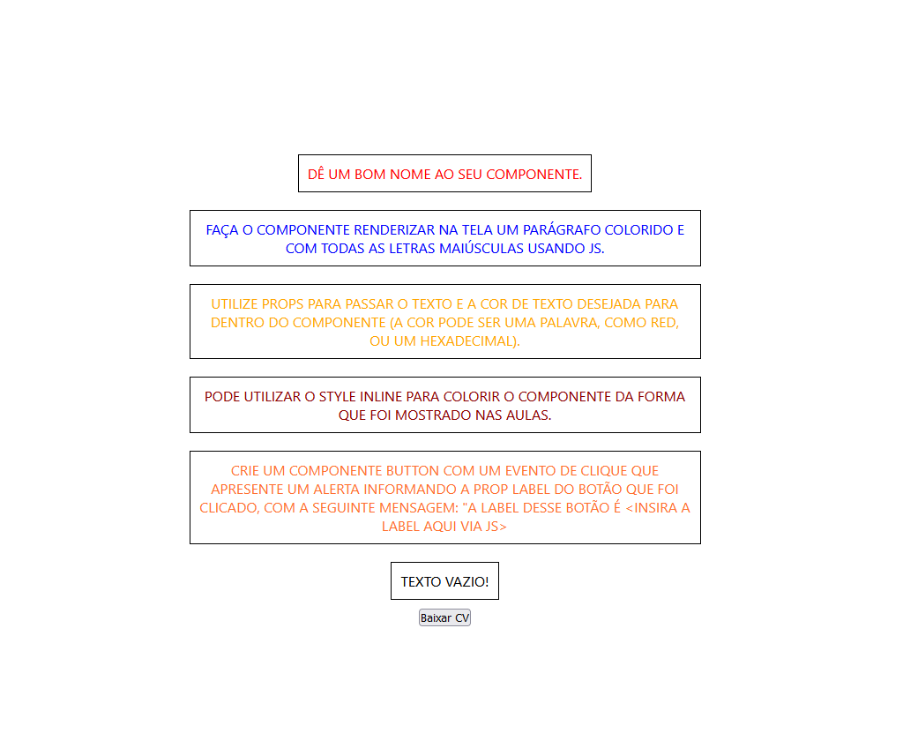

# Curso DevQuest | Desafio Base do React

## Tabela do Conteudo

<ul>
<li><a href="#sobre">Sobre</a></li>
<li><a href="#desafios">Desafios</a></li>
<li><a href="#status">Status</a></li>
<li><a href="#layout">Layout</a></li>
<li><a href="#curiosidade">Curiosidade</a></li>
<li><a href="#tecnologias">Tecnologias</a></li>
</ul>

## Sobre

### Esse desafio consiste na resolução do meu primeiro exercício solicitado pelo curso DevQuest – Dev em Dobro.

#### 1º Commit - Está associado a minha primeira resolução deste desafio. 

#### 2º Commit - É a refatoração desse código após a correção e atualização do README.

## Desafios

<li>Desafio 1 - Componente que colore e transforma um texto para maiúsculo (uppercase) utilizando JS.

    Dê um bom nome ao seu componente;✅

    Faça o componente renderizar na tela um parágrafo colorido e com todas as letras maiúsculas usando JS;✅

    Utilize props para passar o texto e a cor de texto desejada para dentro do componente (a cor pode ser uma palavra, como 'red', ou um hexadecimal);✅

    Pode utilizar o style inline para colorir o componente da forma que foi mostrado nas aulas;✅

<li>Desafio 2 - Mostrar mensagem com a label do botão.

    Crie um componente Button com um evento de clique que apresente um alerta informando a prop label do botão que foi clicado, com a seguinte mensagem: "A label desse botão é <insira a label aqui via JS>";✅

## Status

Desafio finalizado. 🥰

### Layout

## Curiosidade

Este desafio me proporcionou muita satisfação ao concluí-lo. Além disso, pude observar a qualidade da estrutura e organização do código, que são ensinadas pelos professores do curso DevQuest no módulo de JavaScript. Consegui compreender todas as explicações sobre a construção do código e pude concluir as 3 solicitações, mantendo a estrutura original do código.

## Tecnologias

<ul>
<li>HTML</li>
<li>CSS</li>
<li>JavaScript</li>
<li>GIT</li>
</ul>